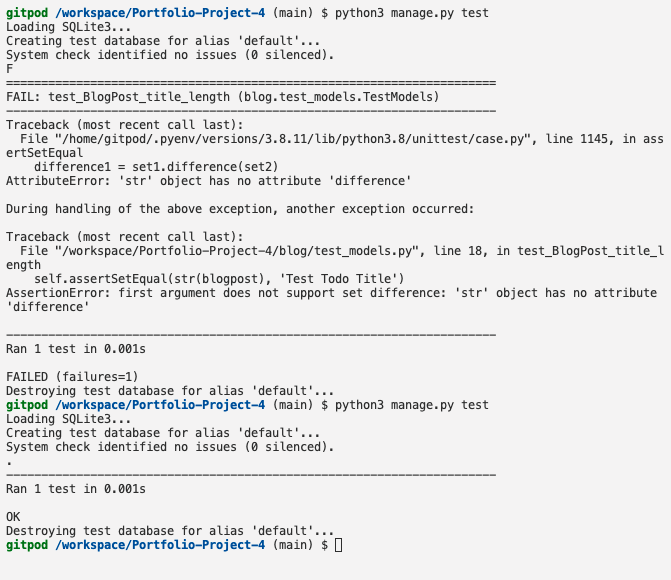

# The Green Thumb

# Navigation Through Content
* [Deployed page](https://the-green-thumb.herokuapp.com/)
* [Project Purpose](#project-purpose)
    - [Learning Outcomes](#learning-outcomes)
    - [Project Requirements](#project-requirements)
* [Initial Planning](#initial-planning)
    - [Lucid Chart](#lucid-chart)
    - [Code Plan](#code-plan)
    - [Media for Inspiration](#media-for-inspiration)
* [Features](#features)
	- [Existing Features](#existing-features)
    - [Features left to implement](#features-left-to-implement)
* [Testing](#testing)
    - [Validator testing](#validator-testing)
    - [Other testing done](#other-testing-done)
* [Bugs](#bugs)
    - [Bugs through the  creation process](#bugs-through-the-creation-process)
    - [Unfixed bugs](#unfixed-bugs)
* [Deployment](#deployment)
* [Credits](#credits)
    - [Mentoring](#mentoring)
    - [Content](#content)
    - [Media](#media)

# Project Purpose
## Learning Outcomes
Taken from Assessment Handbook provided by Code Institute.

### Project requirements
Taken from Assessment Handbook provided by Code Institute or derived therefrom.
- Required langauge: [Python](https://www.python.org/doc/essays/blurb/) 
- Using APIs and library software [Wikipedia](https://en.wikipedia.org/wiki/API)
- Deploy to a cloud-based platform [Heroku](https://www.heroku.com/home)

# Initial planning
### 

### GitHub Projects

### Code Plan

Initial Plan page 1.                                 | Initial Plan page 2
:--------------------------------------------------: | :--------------------------------------------------:
  | 

### Media for inspiration
- 

# User Experience (UX)
## Demographics

## User Goal

# Game Content
## Features

### Existing features

### Features left to implement
- 

# Technologies and Libraries used

### Languages used
- [Python](https://www.python.org/doc/essays/blurb/) 

- [HTML](https://www.w3schools.com/html/html_intro.asp)

- [CSS](https://www.w3schools.com/css/css_intro.asp)

- [JavaScript](https://developer.mozilla.org/en-US/docs/Learn/JavaScript/First_steps/What_is_JavaScript)

### APIs
- 
- 

# Testing
### Validator testing
Validator testing!
### Manual Testing
- Ensured successfull launch of app in Heroku after name change of Project folder.
### Automated Testing
- Continual testing done through the ------ method described in "The Clean Coder- A Code of Conduct for Professional Programmers" by Robert C. Martin and Hello Django lessons.

## Bugs
### Bugs through the creation process
- First bug was connected to trying to gifure out how to write automated tests. It took a lot of research and getting advice from programmers more advanced then me. But in the end I managed to create my very first succesfull automatic test. 

- 
 
 - 
    - 
    - 
    - 

### Unfixed bugs
- 
- 
- 
- 

# Deployment

The project is not deployed
### Checklist:
- to keep track of what to do and improvements on the initial plan, I use a checklist. Since this project isn't working, the list is incomplete.

# Credits

### Content
- 

### Media
- For how to make the nav-bar https://github.com/artkonekt/menu/blob/master/README.md was used.
- As template for README https://github.com/mikakallberg/readme-template/blob/master/README.md was used
- 

- 
- 
- 
