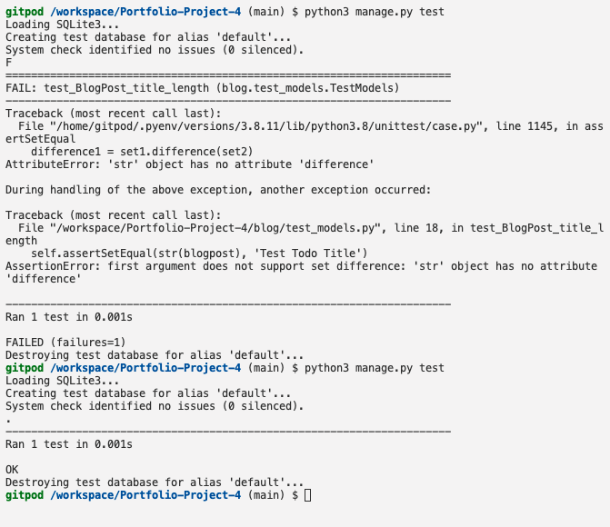

# Bugs 
* [Back to README Home page](/README.md)
# 
### Bugs through the creation process
- First bug was connected to trying to gifure out how to write automated tests. It took a lot of research and getting advice from programmers more advanced then me. But in the end I managed to create my very first succesfull automatic test. 

- Major bug in models.py file when trying to migrate the database. Error message asked to change something in author attribute, but that didn't resolve issue. Had to reset database using the guide from [Delfstack](https://www.delftstack.com/howto/django/django-reset-database/).
- Bug in models.py/excerpt before migrating nedded a default or blank=True.
- Bug in admin.py/@admin.register(BlogPost) automated adding of brackets, could not migrate before removed.
- Bug where index.html didn't render in view. Bugfix add "context_object_name = 'post_list'" to PostList class, system was asked to query from backend, but not what to query. Established bridge to published blogpost through name in for loop on line 10 in index.html.
- Inability to render post_detail.html, misspelling in if-statement attribute on line 24, reported in error statement. Bugfix, correct spelling misstake.
- Inconsistent migration history, resolved by resetting both the SQLite3 amd postgreSQL databases.
- Blog content and excerpt did not appear. Coder forgot to properly add content and excerpt, solved by adding content and excerpt. (Yes, coder and tutor support agent laughed)
- When adding a create_post.html, page doesn't render, gives an error 404 page. Solution change places of the paths in url_patterns in urls.py.
- When trying to POST a new blogpost through the UI, throws error 404, the path the system is taking goes through the projects urls.py. It doesnt find the "http://localhost:8000/create_post/POST" url pattern. Solution add success_url = '/' to forms.py.
- When trying to add summernote editer to my form it's not working. Solution:
  - in forms.py:
    - change the import and class to a class CreatePostForm(forms.ModelForm)
  - in views.py:
    -  Add a class: class CreatePostView(CreateView)
  - In blog/urls.py:
    - change path to: path('create_post/', views.CreatePostView.as_view(), name='create_post'),
- Bug when trying to upload images from UI in cerate_post.html. After meeting with mentor who adviced to fullfill CRUD through comments, so not to expose uploading images to someone trying to overload my filespace in cloudinary. Also It's only going to be admin who posts blogposts.
- Bug in automatically rendered excerpt. Paragraph-elements and classes that render automatically from content gets displayed in excerpt. Solution add a safe tag to the post.content block tag.
- Bug. Trying to add label to commentform in UI. Solution add a comma to fields attribute and relaunch server.
- Large bug. post_detail.html not loading, because of commentsection. cleaning up form for comments and trying different ways of rendering the commentform.
- Large bug. update_post.html not redirecting to post_detail.html. Solution chaning the successful_url to a function form_valid under CommentUpdateView.
- Bug when returning after deleting comment. Solution taking post.slug along from initial url and returning at as argument in a reverse_lazy.
- Bug in carousel at post_detail.html. Typo was found in for loop. 
- Bug while final deployment in Heroku. Error message 500 from deployed app-page. Setting Debug to True to get more info from Heroku error message. Solution connecting to Heroku through terminal, the Multi-Factor Authentication might be why I can't deploy to Heroku according to walkthru.
- Bug while doing Lighthouse testing, background-image doesn't show. 

### Unfixed bugs
- From information from Tutor support pylint error are from Pyhton not being able to recognize django code properly, so all pylint bugs are left.
#### Blog-folder
- admin.py
- - pylint error
- models.py
- - 3 pylint errors
- views.py
- - 6 pylint errors
#### App-folder
- settings.py
- - 5 pylint errors
- - 1 flake error regarding the env.py file, added in when following " I think therefore I blog walkthru"
#
*[Back to README Home page](/README.md)
#